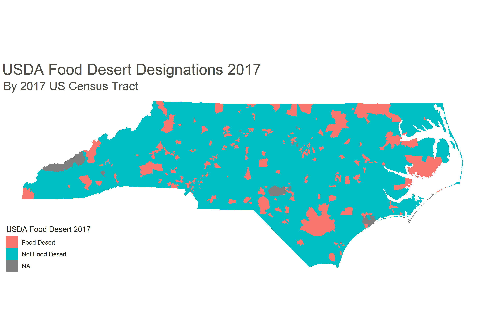

# cfc_ds_screen
 Data, Analysis, and objects for Cape Fear Collective DS technical screen.

**Table of Contents**

* **Main**
  * cfc_ds_screen.Rproj : R project for analyses.
* **data**
  * food.desert – Binary classification of food deserts, poverty rates, and median household income.
  * population – County population over time.
  * ruca.usda – RUCA codes, tract population, and Census tract land area.
  * stores – The number of grocery stores, supercenters, convenience stores, and specialty food stores.
  * vehicles – The number of cars per household.
  * cb_2017_37_tract_500k - GeoDB of North Carolina Census tracts from <a href=https://www.census.gov/geographies/mapping-files/time-series/geo/carto-boundary-file.2017.html>here.</a>
  * DS Technical Screen.pdf - Assignment description.
* **doc**
  * 2020_11_25_cfc_ds_technical_screen_haywood.pptx - Presentation of analysis.
* **output**
  * Contains various graphs from analysis.
* **R**
  * 00_init.R - Initialize some variables, load packages, set random seed, etc. Source this program when opening the project.
  * 01_explore_data.R - Perform univariate exploration of features and generate a clean dataset with one row per tract.
  * 02_feature_gen_multivariate.R - Perform multivariate analysis w.r.t. food deserts and generate features.
  * 03_feature_select_modeling.R - Analyze univariate logistic models and random forests to determine the most predictive models.
  * 04_mapping_graphing.R - Build graphs and maps to presentation quality.
   

